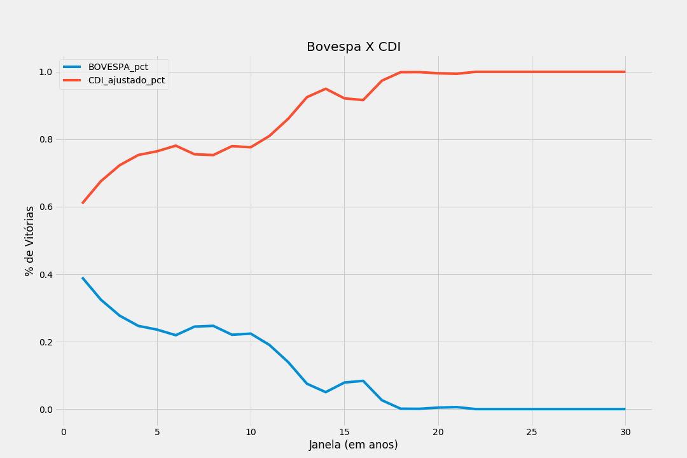

# Bovespa ou CDI? RF ou RV?

Esse repositório tem uma tentativa de reprodução dos resultados encontrados por Samy Dana na discussão no Twitter entre quem "ganhava" no longo prazo, Renda Fixa (RF) ou Renda Variável (RV).

## Dados

Dados foram retirados do [Sistema de Séries Temporais do Banco Central Brasileiro](https://www3.bcb.gov.br/sgspub/), utilizando as seguintes séries:
- Código 7 - Bovespa index
- Código 12 - Interest rate - CDI

## Método

Foram comparadas múltiplas janelas de 1 até 30 anos para comparação dos rendimentos entre o índice Bovespa versus o CDI, utilizando dados disponíveis a partir de 29/12/1989.

Por exemplo, usando a janela de 1 ano, foram simulados os retornos de quem comprou o ativo no dia 29/12/1989 e ficou até 18/12/1990, de quem comprou no dia 02/01/1990 e ficou até 20/12/1990 e assim sucessivamente.

Se na janela de 29/12/1989 até 18/12/1990 o CDI foi melhor que o BOVESPA, é adicionada 1 vitória para o CDI, se o BOVESPA for melhor é adicionada uma vitória para a BOVESPA.

E então, são calculados percentuais de vitória para cada janela, ou seja, se o CDI venceu 4051 vezes e o BOVESPA venceu 2595 vezes, na janela de 1 ano, temos 60.95% de vitórias para o CDI e 39.05% de vitórias para o BOVESPA.

## Resultados

Em todas as janelas simuladas (1 à 30 anos), o CDI teve um maior percentual de vitórias sobre o índice BOVESPA.

Os resultados finais da simulação estão no arquivo results.csv na pasta data.

Os arquivos de simulação estão na pasta data, com o nome bovespa-x-cdi-window-{JANELA}.csv, onde {JANELA} se refere à janela de 1, 2, 3...30 anos.

## Observações

É importante notar que não foi simulado impostos, corretagem e etc, apenas o valor dos retornos.

## Pacotes utilizados:
- pandas
- sgs

